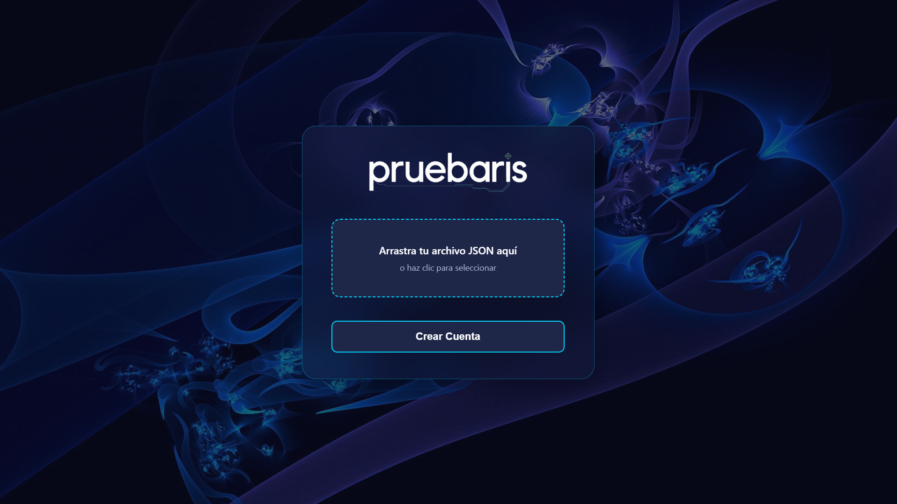

# Pruebaris v1.2

**Aplicación web educativa de preguntas y respuestas sobre programación**

[](https://lucaslr2.github.io/Pruebaris/)

**[Acceder a Pruebaris](https://lucaslr2.github.io/Pruebaris/)**

---

## Descripción

Pruebaris es un juego interactivo diseñado para aprender y practicar conceptos de programación a través de preguntas de opción múltiple. Ofrece una experiencia gamificada con dos modos de juego distintos y un completo sistema de logros para motivar el aprendizaje continuo.

**Estado del proyecto:** ✅ **100% Funcional y Completo**

Este proyecto se encuentra totalmente operativo y listo para uso. Aunque está abierto a futuras mejoras y ampliaciones, todas las funcionalidades principales están implementadas y funcionando correctamente.

---

## Características Principales

### Sistema de Perfiles
- Creación de cuenta con avatar personalizable (10 avatares disponibles)
- Guardado local mediante LocalStorage
- Exportación e importación de perfiles en formato JSON
- Edición de perfil con cambio de nombre y avatar
- Sistema de drag & drop para carga de archivos

### Modos de Juego

**Modo Normal**
- 70 preguntas cuidadosamente seleccionadas
- 1 punto por respuesta correcta
- Sin penalización por errores
- Ideal para aprendizaje progresivo
- Finaliza automáticamente al completar todas las preguntas

**Modo Infinito**
- Preguntas aleatorias sin límite
- Puntuación variable (1-3 puntos según dificultad)
- Penalización por respuestas incorrectas
- Desafío continuo para usuarios avanzados
- Opción de terminar la partida cuando el jugador desee

### Sistema de Progresión
- 10 logros desbloqueables
- Estadísticas detalladas de rendimiento
- Seguimiento de partidas jugadas
- Registro de puntos acumulados y precisión
- Seguimiento de rachas de respuestas correctas
- Mejores puntuaciones por modo de juego

---

## Contenido Educativo

El banco de preguntas abarca los siguientes temas fundamentales de programación:

- **Programación Orientada a Objetos (POO)** - Conceptos de clases, herencia, polimorfismo y encapsulación
- **Estructuras de Datos** - Arrays, listas enlazadas, pilas, colas y árboles
- **Bases de Datos y SQL** - Consultas, normalización y gestión de datos
- **Redes y Protocolos** - TCP/IP, HTTP, DNS y arquitectura de redes
- **Hardware y Arquitectura** - Componentes de computadores y organización de sistemas

**Total:** 70 preguntas con 6 opciones de respuesta cada una

---

## Estructura del Proyecto

```
Pruebaris/
│
├── index.html              # Pantalla de login y creación de cuentas
├── pruebaris.html          # Interfaz principal del juego
├── README.md               # Documentación del proyecto
│
├── css/
│   └── styles.css          # Estilos globales con variables CSS
│
├── js/
│   └── game.js             # Lógica del juego y sistema de preguntas
│
└── resources/
    ├── Login.png           # Imagen de fondo
    ├── Logo-sf.png         # Logo del proyecto
    ├── diamond-sf.png      # Favicon del proyecto
    ├── README.png          # Captura para documentación
    └── avatars/            # Carpeta con 10 avatares
        ├── Avatar-1.png
        ├── Avatar-2.png
        └── ...
```

---

## Instalación y Uso

### Acceso Directo

**Prueba la aplicación en línea:** [https://lucaslr2.github.io/Pruebaris/](https://lucaslr2.github.io/Pruebaris/)

### Instalación Local

1. **Descarga el proyecto**
   ```bash
   git clone [URL-del-repositorio]
   cd pruebaris
   ```

2. **Ejecuta la aplicación**
   - Abre `index.html` en tu navegador web preferido
   - No requiere instalación de dependencias ni servidor

3. **Crea tu perfil**
   - Ingresa un nombre de usuario
   - Selecciona tu avatar favorito
   - Tu perfil se guardará automáticamente y se descargará un archivo JSON

4. **Carga un perfil existente**
   - Arrastra y suelta tu archivo JSON en la zona de carga
   - O haz clic para seleccionarlo manualmente

5. **Comienza a jugar**
   - Elige entre Modo Normal o Modo Infinito
   - Responde las preguntas y desbloquea logros
   - Consulta tus estadísticas en el dashboard

---

## Tecnologías Utilizadas

- **HTML5** - Estructura semántica y moderna
- **CSS3** - Variables CSS, Flexbox, Grid y diseño responsive
- **JavaScript Vanilla** - Sin frameworks externos
- **LocalStorage API** - Persistencia de datos del navegador
- **Lucide Icons** - Iconografía moderna y limpia
- **Glassmorphism** - Efectos visuales modernos con backdrop-filter

---

## Notas de Versión

### v1.2 - Versión Actual (Proyecto Completo)

**Nuevas Funcionalidades**
- Botón para terminar partida en Modo Infinito
- Favicon personalizado del proyecto
- Sistema completo de gestión de avatares locales

**Estado Final**
- ✅ Todas las funcionalidades implementadas
- ✅ Sistema de logros funcionando correctamente
- ✅ Dos modos de juego completamente operativos
- ✅ Interfaz responsive y optimizada
- ✅ Sistema de guardado y exportación de perfiles
- ✅ 70 preguntas sobre programación

**Proyecto declarado como completo y funcional**

### v1.1 - Actualización de Diseño

**Mejoras de Diseño**
- Interfaz de login rediseñada con efectos glassmorphism
- Sistema de carga de archivos con drag & drop integrado
- Selector de avatares circular con scroll horizontal optimizado
- Experiencia de usuario mejorada y más fluida

**Optimizaciones**
- Eliminación de elementos redundantes en la UI
- Mejora en la disposición de elementos
- Ajustes de espaciado y padding

### v1.0 - Versión Inicial

**Funcionalidades Implementadas**
- Sistema completo de gestión de perfiles
- 70 preguntas sobre conceptos fundamentales de programación
- Dos modos de juego con mecánicas distintas
- Sistema de logros y estadísticas detalladas
- Interfaz responsive con tema oscuro y efectos glass

---

## Logros Disponibles

1. **Primer Paso** 🎯 - Completa tu primera partida
2. **Estudiante Dedicado** 📚 - Juega 10 partidas
3. **Perfeccionista** 💯 - Obtén 70/70 en modo normal
4. **Racha de 10** 🔥 - Responde 10 preguntas correctas seguidas
5. **Centurión** ⚡ - Alcanza 100 puntos en modo infinito
6. **Maestro del Conocimiento** 🎓 - Responde 500 preguntas correctas
7. **Incansable** 💪 - Juega 50 partidas
8. **Experto en Normal** 🏅 - Completa 25 partidas en modo normal
9. **Sobreviviente** 🏆 - Alcanza 200 puntos en modo infinito
10. **Leyenda de Pruebaris** 👑 - Responde 1000 preguntas correctas

---

## Recomendaciones de Uso

- **Exporta tu perfil regularmente** para evitar pérdida de datos
- **Modo Normal** recomendado para principiantes y estudio
- **Modo Infinito** recomendado para practicar y mejorar precisión
- Compatible con navegadores modernos (Chrome, Firefox, Edge, Safari)
- Funciona en dispositivos móviles y tablets

---

## Compatibilidad

- ✅ Chrome 90+
- ✅ Firefox 88+
- ✅ Safari 14+
- ✅ Edge 90+
- ✅ Navegadores móviles modernos
- ✅ Tablets y dispositivos táctiles

---

## Contribuciones y Mejoras Futuras

Este proyecto está **100% funcional y completo** en su versión actual. Sin embargo, está abierto a futuras mejoras y contribuciones de la comunidad:

### Posibles Mejoras Futuras
- Agregar más preguntas al banco de datos
- Implementar nuevos modos de juego
- Sistema de dificultad progresiva
- Tabla de clasificación local
- Más temas de programación
- Sistema de recompensas adicionales
- Modo de práctica por temas específicos
- Estadísticas más detalladas

**¡Todas las sugerencias y contribuciones son bienvenidas!**

---

## Créditos y Desarrollo

**Desarrollo:** Proyecto desarrollado mediante colaboración entre Inteligencia Artificial y desarrollo manual

**Distribución del trabajo:**
- 💻 **60% Inteligencia Artificial** - Estructura base, lógica inicial y componentes
- 🎨 **40% Desarrollo Manual** - Diseño, lógica refinada, datos y estructura final

**Áreas de personalización manual:**
- Diseño y experiencia de usuario
- Sistema de logros y balanceo
- Banco de preguntas y respuestas
- Estructura de archivos y organización
- Optimizaciones de rendimiento
- Ajustes visuales y de interfaz

---

## Limitaciones Conocidas

- Los datos se almacenan únicamente en LocalStorage del navegador
- Limpiar caché o datos del navegador eliminará el progreso
- No incluye funcionalidad multijugador
- No incluye tabla de clasificación global
- Las preguntas no se actualizan dinámicamente (requiere actualización del código)

**Solución recomendada:** Exportar el perfil regularmente como respaldo

---

## Licencia

Este proyecto es de código abierto y está disponible para fines educativos y personales.

Puedes:
- ✅ Usar el proyecto libremente
- ✅ Modificar y mejorar el código
- ✅ Distribuir tus propias versiones
- ✅ Aprender del código fuente

---

## Agradecimientos

Gracias a todos los que prueben, usen y contribuyan a mejorar Pruebaris. Este proyecto fue creado con el objetivo de facilitar el aprendizaje de conceptos de programación de una manera divertida e interactiva.

---

**Versión:** 1.2 (Completa)  
**Estado:** ✅ 100% Funcional  
**Última actualización:** 2024  
**Demo en vivo:** [https://lucaslr2.github.io/Pruebaris/](https://lucaslr2.github.io/Pruebaris/)

---

**¿Encontraste algún bug o tienes sugerencias?**  
Abre un issue o contribuye directamente al proyecto. ¡Toda ayuda es bienvenida! 🚀